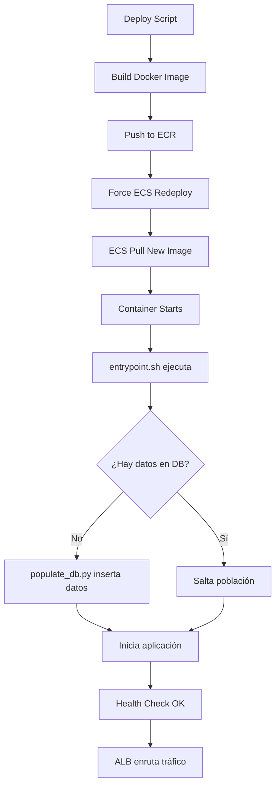

# 🗄️ Resumen: Inicialización Automática de Datos en AWS

## 📋 Problema Identificado

Las bases de datos RDS en AWS se creaban **vacías**, sin datos de ejemplo, porque:

| Entorno | Comportamiento |
|---------|----------------|
| **Docker Compose (Local)** | ✅ Scripts SQL (`001_init.sql`) se ejecutan automáticamente al crear el contenedor PostgreSQL |
| **AWS/Terraform** | ❌ RDS solo crea la base de datos vacía. Los scripts SQL NO se ejecutan |

### Por qué sucede esto:

- **Docker Compose**: Monta archivos SQL en `/docker-entrypoint-initdb.d/` del contenedor PostgreSQL, que los ejecuta automáticamente
- **AWS RDS**: Es un servicio administrado que solo crea la base de datos vacía. No tiene mecanismo para ejecutar scripts de inicialización

---

## ✅ Solución Implementada

Hemos modificado los servicios para que **inicialicen automáticamente** los datos al arrancar los contenedores ECS.

### Cambios Realizados

#### 1. **Cliente-Service**

**Archivos creados/modificados:**

- **`cliente-service/entrypoint.sh`** (NUEVO)
  - Script que se ejecuta antes de arrancar la aplicación
  - Ejecuta el script de población de datos
  - Es idempotente (verifica si ya hay datos antes de insertar)

```bash
#!/bin/bash
# Verificar DATABASE_URL
# Ejecutar populate_db.py (que ya existía)
# Iniciar uvicorn
```

- **`cliente-service/Dockerfile`** (MODIFICADO)
  - Agregado: Copia del `entrypoint.sh`
  - Agregado: `ENTRYPOINT ["/app/entrypoint.sh"]`
  - Modificado: Health check con más tiempo de inicio (60s en vez de 30s)

**Flujo de inicialización:**
```
Contenedor arranca
    ↓
entrypoint.sh ejecuta
    ↓
populate_db.py verifica si hay datos
    ↓
Si NO hay datos → Inserta 5 clientes + compras + devoluciones
Si hay datos → No hace nada (idempotente)
    ↓
Inicia aplicación (uvicorn)
```

#### 2. **Catalogo-Service**

**Archivos creados/modificados:**

- **`catalogo-service/app/populate_db.py`** (NUEVO)
  - Script Python que lee `data/001_init.sql`
  - Ejecuta los statements SQL usando SQLAlchemy
  - Es idempotente (verifica si ya hay productos antes de insertar)

- **`catalogo-service/entrypoint.sh`** (NUEVO)
  - Similar al de cliente-service
  - Ejecuta `populate_db.py` antes de arrancar la aplicación

- **`catalogo-service/Dockerfile`** (MODIFICADO)
  - Agregado: Copia de `data/` folder (scripts SQL)
  - Agregado: Copia del `entrypoint.sh`
  - Agregado: `ENTRYPOINT ["/app/entrypoint.sh"]`
  - Agregado: Health check con más tiempo de inicio
  - Modificado: Health check definido en Dockerfile

**Flujo de inicialización:**
```
Contenedor arranca
    ↓
entrypoint.sh ejecuta
    ↓
populate_db.py lee 001_init.sql
    ↓
Verifica si hay productos
    ↓
Si NO hay productos → Inserta 25 productos + inventarios
Si hay productos → No hace nada (idempotente)
    ↓
Inicia aplicación (uvicorn)
```

---

## 🚀 Despliegue de los Cambios

### Opción 1: Scripts de Deploy Individuales (RECOMENDADO)

Ejecuta estos comandos desde la raíz del proyecto:

```bash
# 1. Cliente Service
./deploy-cliente-service.sh

# 2. Catalogo Service
./deploy-catalogo-service.sh
```

### Opción 2: Script Unificado

```bash
./redeploy-with-data-init.sh
```

### Lo que hacen estos scripts:

1. 🔨 **Build**: Construyen la imagen Docker con `--platform linux/amd64`
2. 🏷️ **Tag**: Etiquetan la imagen para ECR
3. 🔐 **Auth**: Se autentican con AWS ECR
4. 📤 **Push**: Suben la imagen a ECR
5. 🔄 **Deploy**: Fuerzan un nuevo despliegue en ECS
6. 👀 **Monitor**: Esperan a que el despliegue se complete

---

## 📊 Datos que se Inicializan

### Cliente-Service

**Cuando arranque el contenedor en AWS, insertará automáticamente:**

- ✅ **5 Clientes** de ejemplo:
  - Farmacia San José (CLI001)
  - Droguería El Buen Pastor (CLI002)
  - Farmatodo Zona Norte (CLI003)
  - Centro Médico Salud Total (CLI004)
  - Farmacia Popular (CLI005)

- ✅ **15 Compras históricas** distribuidas entre los clientes
- ✅ **4 Devoluciones** con motivos realistas
- ✅ **5 Logs de consulta** para trazabilidad

### Catalogo-Service

**Cuando arranque el contenedor en AWS, insertará automáticamente:**

- ✅ **25 Productos** en 5 categorías:
  - Antibióticos (5 productos)
  - Analgésicos (5 productos)
  - Cardiovasculares (5 productos)
  - Respiratorios (5 productos)
  - Gastrointestinales (5 productos)

- ✅ **24 Registros de inventario** en múltiples países y bodegas
  - Colombia (CO)
  - México (MX)
  - Perú (PE)
  - Chile (CL)

---

## 🧪 Verificación Post-Despliegue

### 1. Verificar que el despliegue se completó

```bash
# Cliente Service
aws ecs describe-services \
  --cluster medisupply-dev-cluster \
  --services medisupply-dev-cliente-service-svc \
  --region us-east-1 \
  --query 'services[0].[serviceName,status,runningCount,desiredCount]'

# Catalogo Service
aws ecs describe-services \
  --cluster medisupply-dev-cluster \
  --services medisupply-dev-catalogo-service-svc \
  --region us-east-1 \
  --query 'services[0].[serviceName,status,runningCount,desiredCount]'
```

### 2. Verificar logs de inicialización

```bash
# Ver logs de Cliente Service (buscar mensajes de población)
aws logs tail /ecs/medisupply-dev-cliente-service --follow --region us-east-1

# Ver logs de Catalogo Service (buscar mensajes de población)
aws logs tail /ecs/medisupply-dev-catalogo-service --follow --region us-east-1
```

**Busca estos mensajes en los logs:**

Cliente Service:
```
🔄 Poblando base de datos con datos de ejemplo...
✅ 5 clientes agregados
✅ 15 compras agregadas
✅ 4 devoluciones agregadas
🎉 Base de datos poblada exitosamente con datos de ejemplo
🚀 Iniciando aplicación...
```

Catalogo Service:
```
🔄 Poblando base de datos de catálogo...
📄 Cargando datos desde 001_init.sql...
🎉 Base de datos poblada exitosamente
   📦 Productos: 25
   🏭 Registros de inventario: 24
🚀 Iniciando aplicación...
```

### 3. Probar los endpoints

```bash
# Cliente Service - Listar clientes
curl http://medisupply-dev-bff-cliente-alb-1673122993.us-east-1.elb.amazonaws.com/api/v1/client/?limite=10

# Catalogo Service - Listar productos
curl http://medisupply-dev-catalogo-alb-1899906226.us-east-1.elb.amazonaws.com/api/productos?limite=10
```

**Respuesta esperada:**
- ❌ Antes: `[]` (array vacío)
- ✅ Después: Array con datos de clientes/productos

---

## 🔍 Troubleshooting

### Problema: El servicio no arranca

**Síntomas:**
- `runningCount=0` en ECS
- Tasks fallan constantemente

**Solución:**
```bash
# Ver logs para identificar el error
aws logs tail /ecs/medisupply-dev-cliente-service --since 10m --region us-east-1
```

### Problema: Los datos no se insertan

**Síntomas:**
- El endpoint retorna `[]`
- Logs muestran "Base de datos ya tiene X clientes"

**Causa:**
- Los datos ya fueron insertados en un arranque anterior
- El script es idempotente y no reinserta datos

**Solución (si quieres reiniciar los datos):**
```bash
# Conectarte a RDS y borrar los datos manualmente
# O esperar a que se borren naturalmente si la BD se recrea
```

### Problema: Error de conexión a base de datos

**Síntomas:**
```
❌ Error al poblar base de datos: Could not connect to database
```

**Solución:**
- Verificar que el Security Group del RDS permite conexiones desde el ECS Service
- Verificar que el `DATABASE_URL` en Secrets Manager sea correcto

---

## 📝 Ventajas de esta Solución

✅ **Automática**: No requiere intervención manual
✅ **Idempotente**: Puede ejecutarse múltiples veces sin duplicar datos
✅ **Segura**: No inserta datos si ya existen
✅ **Rápida**: Se ejecuta al arrancar el contenedor (segundos)
✅ **Consistente**: Mismos datos en todos los ambientes
✅ **Mantenible**: Scripts SQL centralizados en `data/001_init.sql`

---

## 🔄 Flujo Completo de Despliegue



---

## 🎯 Próximos Pasos

1. **Ejecutar deploy scripts**:
   ```bash
   ./deploy-cliente-service.sh
   ./deploy-catalogo-service.sh
   ```

2. **Monitorear logs** durante 2-3 minutos para confirmar inicialización

3. **Probar endpoints** para verificar que retornan datos

4. **(Opcional)** Hacer lo mismo para `bff-venta` si necesita inicialización de datos

---

## 📌 Archivos Modificados/Creados

```
MediSupply-Backend/
├── cliente-service/
│   ├── Dockerfile                  (MODIFICADO)
│   ├── entrypoint.sh              (NUEVO)
│   └── app/
│       └── populate_db.py         (YA EXISTÍA - Sin cambios)
│
├── catalogo-service/
│   ├── Dockerfile                  (MODIFICADO)
│   ├── entrypoint.sh              (NUEVO)
│   └── app/
│       └── populate_db.py         (NUEVO)
│
├── deploy-cliente-service.sh      (SIN CAMBIOS - Usar para deploy)
├── deploy-catalogo-service.sh     (SIN CAMBIOS - Usar para deploy)
├── redeploy-with-data-init.sh     (NUEVO - Script unificado opcional)
└── RESUMEN-INICIALIZACION-DATOS.md (ESTE ARCHIVO)
```

---

## ✅ Checklist Final

- [ ] Leer este documento completo
- [ ] Ejecutar `./deploy-cliente-service.sh`
- [ ] Esperar a que termine el despliegue
- [ ] Verificar logs de Cliente Service
- [ ] Probar endpoint de Cliente
- [ ] Ejecutar `./deploy-catalogo-service.sh`
- [ ] Esperar a que termine el despliegue
- [ ] Verificar logs de Catalogo Service
- [ ] Probar endpoint de Catalogo
- [ ] Confirmar que ambos servicios retornan datos

---

**¿Listo para desplegar?** Ejecuta:

```bash
./deploy-cliente-service.sh && ./deploy-catalogo-service.sh
```

Y en 5-10 minutos tendrás los servicios corriendo con datos iniciales! 🎉


